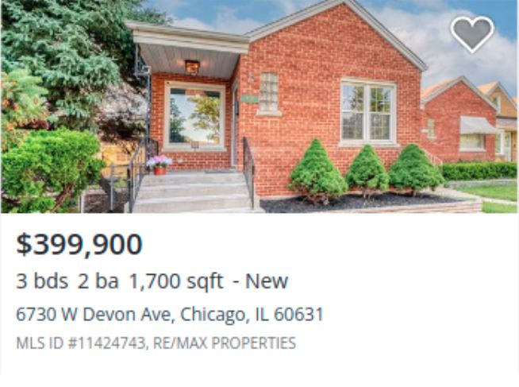
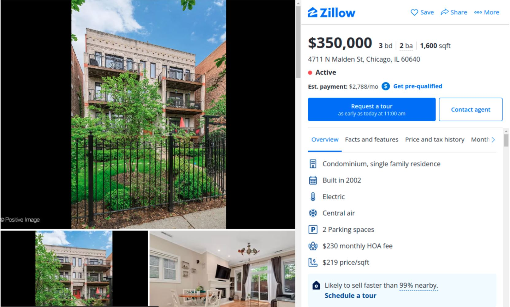

# Listing Provider


## Introduction

A listing service is a database of a company that is collected from real estate brokers who agree to publish their information and listings in public. These companies publish their listings online to connect buyers and sellers.
## Definitions

#### Listing
Property ads in web pages are called listings.

#### Card
A block in a web page containing some basic information from a listing.


#### Single
A listing page. A page from a website that contains all information related to a listing. 



## Procedure
A source is provided for you to get listing data from. Two different methods can be used to get the required data, API call or scraping. API call is the smartest choice when available, however it is not always possible, and therefore, its availability should be checked. Our first move in this project is to choose between these two methods based on what the website offers. 

Two urls are crawled, one for sale page and one for rent page (only first page of each url is  crawled). These urls are for the whole country if possible, otherwise for the most populated city in the country. Besides, the listings in the urls should be in date descending order.

This project contains 3 main stages. Each stage is designed to give a certain output. First stage is a card crawler. In this stage, a sale or rent page is scraped or API called, and all its listing urls are gathered. Subsequently, each listing url is inputted into a single crawler, second stage. This stage scrapes or API calls the single page and outputs some necessary information in dict type, which is explained later. Finally, the third stage, which is called mapping, inputs the crawled information from the single page and maps it into a desired format in dict type.

Another step is used at the end to evaluate your final mapping. This code inputs your mapping and outputs the wrong formattings in the mapping.

A runner is used to connect all of these classes and functions together (run.py).

## Stage 1: Card Crawler
This is the first stage of the providing process. This stage gives us urls to single pages needed for crawling the information (impl/Card_Crawler.py).

## Stage 2: Single Crawler
This stage gets every necessary information from the single page. This information contains somewhat everything that is on the page related to the listing that we want. According to the mapping template provided for you, you can understand the attributes that are necessary for a listing to be useful. Some attributes are necessary and without them, you can cancel the process for that specific listing. However, some attributes can be ignored and become an empty string (impl/Single_Crawler.py).

## Stage 3: Mapping
This stage is the most important part of the process, since it has to output something in a precise format with all the necessary information or otherwise, the output is not useful at all. This part is all about mapping attributes extracted from a single page to ids and type ids. These ids can be seen in the attribute mapper file provided for you. A glance of the attribute mapper is shown in the following.

Attributes that need to be mapped into ids and type ids are:
- [ ] Current status id (same for all listings)   —> mapping_template[currentStatusId]
- [ ] Listing type (sale or rent)   —> mapping_template[listingTypeId]
- [ ] Land use type (residential or commercial)  —> mapping_template[attributes][specifics]
- [ ] Property type (house/apartment/condo/…)  —> mapping_template[attributes][specifics]
- [ ] Amenities or features (garden/pool/sauna/…)  —> mapping_template[attributes][specifics]
- [ ] Property tags (open house/renovated/year built/…)  —> mapping_template[attributes][specifics]
- [ ] Sources (agent/owner/agency)   —> mapping_template[sourceId]

All these attributes are among the necessary attributes and should be all filled. Each of these attributes’ places in the mapping template is provided in front of them.

ATTENTION: name_lat and name_loc in propertyFeatures/propertyTypes/propertyTags/landuseTypes/listingTypes can be replaced with synonyms of those attributes based on the usage of words in the website.

Mapping template is shown in the following. 

```
{
 "sourceId": null,      # source id (agent, owner, or unknown) form attribute_mapper
 "contactInfo": {
   "callNumber": null,  # should be filled 
   "fullName": null,
   "type": null,        # "AGENT", "OWNER" or "AGENCY"
   "logoUrl": null,     # real estate url
   "nameLocal": null,   # real estate name in local language
   "nameLat": null      # real estate name in english
 },
 "currentStatusId": null,
 "listingTypeId": null,
 "attributes": {
   "floorArea": {
     "value": null,     # int value only
     "unit": null
   },
   "noBeds": null,      # int value only
   "noBaths": null,     # int value only
   "noParkings": null,  # int value only
   "specifics": [       # MUST have property type and land use type
     {
       "typeId": null,
       "type": null,    # PROPERTY_TYPE, LAND_USE_TYPE, PROPERTY_FEATURE, PROPERTY_TAG
       "id": null
     }
   ]
 },
 "values": {       # deposit is added here if there is one (for rent)
   "price": null,  # int value, only for sale listings
   "rent": null,   # int value, only for rent listings 
   "rentFrequemcy": null,    # py or pm or pw, only for rent listings
   "unitPrice": null,
   "currency": {
     "value": null  # price currency. e.g. EUR, USD, ...
   }
 },
 "location": {
   "mainLocation": null,   # the main location of listing
   "longitude": null,   # float value only
   "latitude": null     # float value only
 },
 "media": [
   {
     "type": null,      # 'PHOTO' or 'VIDEO'
     "photoSmallUrl": null,
     "photoLargeUrl": null,
     "isCover": null    # true for the first photo
   }
 ],
 "additionalInfo": [    # any property tag that has a value and is not fitted
   {                    # in other parts   
     "key": null,       # title and description has to be included
     "value": null      # "key"s should be camelCase
   }
 ],
 "sourceUrl": null    # url to the listing page
}
```

## Unit Test

This part is a code that can help you debug your code based on what we need from the output of this procedure. The code is as follows. It simply inputs a list of mapped jsons and for each one prints the problems in the mapping (tester/unit_test.py).

## Workflow
* Make a branch for the country and website you are working on with this name structure 
`{country_name}-{website_name}`. Example branch name for the Netherlands, and Immobilier website will 
be: `netherlands-immobilier`
* Use the `static` directory if you want to add any additional file required for your codes and pipeline
* Use the `impl` directory to put your codes on. Try to stay at the crawling and mapping objects structures as far as possible.
* The codes **MUST** be reproducible, and clean. It's very important. During the time, the structure of the websites 
you are crawling  will change periodically. So every engineer working on this project needs to grasp the codes and 
materials you provided completely, fast and easily to do the required modifications.
